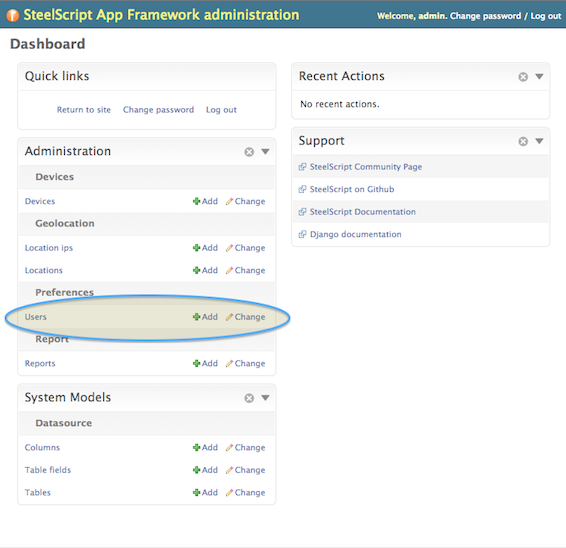

Configuration
=============

Once a project has been created (see :doc:`projects`), a ``local_settings.py``
file will be in the directory with default settings available for customization.

Setting up the database
-----------------------

By default, ``local_settings.py`` uses a simple sqlite database to store
configurations, reports, and other data.  This is fine for single-user
and basic development, but sqlite has concurrancy and performance limitations
which make it unsuitable for more dedicated use.

.. code-block:: python

    DATABASES = {
        'default': {
            # Optionally change 'sqlite3' to 'postgresql_psycopg2', 'mysql' or 'oracle'.
            # for connection to other database engines
            'ENGINE': 'django.db.backends.sqlite3',

            # Path to database file if using sqlite3.
            # Database name for others
            'NAME': os.path.join(DATAHOME, 'data', 'project.db'),

            'USER': '',     # Not used with sqlite3.
            'PASSWORD': '', # Not used with sqlite3.
            'HOST': '',     # Set to empty string for localhost. Not used with sqlite3.
            'PORT': '',     # Set to empty string for default. Not used with sqlite3.
        }
    }

More detailed discussion of these parameters can be found in the
`django documentation <https://docs.djangoproject.com/en/1.5/ref/settings/#databases>`_.
If help is needed configuring a MySql or PostgreSQL database, many resources
are available online.

After changes are made to this entry, you will need to initialize the new
database tables from App Framework by running the :ref:`reset_appfwk <reset appfwk>`
command.

.. _devices:

Devices
-------

With a freshly initialized server, the first login to the server will bring
up the "Edit Devices" page.  This page is only accessible to admin users,
and provides a means to add devices for use throughout the site.

Click on "Add New Device" and fill out the requested information for
each device you'd like to be able to use as a datasource.

.. _user preferences:

User Preferences
----------------

After setting up devices, navigate to the upper-right button and choose
"Preferences".  This will bring up a simple dialog allowing updates to
the admin user password, email address, and timezone.  Further discussion of
user management is described in the section below, :ref:`managing users`.

Note that each user will be able to change their own timezone and email address.

.. _system settings:

System Settings
---------------

Navigating to the upper-right button and choosing "System Settings" bring up
the admin-only list of system configuration items.

    * ``Ignore cache`` - every report will be re-run directly from the source
      device, ignoring any locally stored cache
    * ``Developer mode`` - enables an option under Report Run widgets called
      "Debug this report", which will rollover the server logs, run the report,
      collect logs, then prompt the user to download a zipfile of the collected
      information.  Due to the potentially sensitive nature of the log files,
      this should be turned off except for explicit debugging purposes.
    * ``Enable Map Widgets`` - provides the option to enable/disable
      all map widgets, and if enabled, to choose between OpenStreetMap
      sources and Google Maps sources.  In order to use Google Maps,
      an ``API Key`` or a ``Client ID`` is required.  See :ref:`map widgets`
      for more information.

.. _map widgets:

Map Widgets
^^^^^^^^^^^

Two options are availble for Map Widgets in App Framework,
`OpenStreetMap <http://www.openstreetmap.org/about>`_ and
`Google Maps <https://developers.google.com/maps/>`_.  Use of either service
is subject to their license terms.  Additionally, use of Google Maps
requires one of two types of api keys, please check with your IT administrator
which one is appropriate for your use, and see the following links for more
information:

    * `Google Maps API Key <https://developers.google.com/maps/documentation/javascript/tutorial>`_
    * `Google Maps Client ID <https://developers.google.com/maps/documentation/business/clientside/#MapsJS>`_

.. _locations import:

Locations
---------

The Geolocation functionality of App Framework relies on internally
stored set of locations and IP address mappings in order to accurately
plot data points.  Included in the :ref:`example-configs <directory layout>`
directory are two locations files you can modify to meet your internal
network layout.  To install these files (or your own similarly created
ones):

.. code-block:: console

    $ cd appfwk_project
    $ python manage.py locations --import-locations example-configs/sample_locations.txt
    Imported 13 locations
    $ python manage.py locations --import-location-ip example-configs/sample_location_ip.txt
    Imported 13 locations/ip entries

.. _managing users:

Managing users
--------------

As a default, a single user is enabled on the system with the username /
password combination: ``admin`` / ``admin``.  This account has full administrative
rights and should only be used by trusted users.

The password for this default account can be changed at any time via the
"Change User Password" link under admin->Preferences.

To add additional user accounts or manage existing ones, choose the
"Admin Panel" option from the dropdown menu.  This will lead to page similar to
the following:

You can use the ``Add`` button directly from this page or click on ``Users`` to
manage all locally stored user accounts.

Using LDAP for Authentication
-----------------------------

A file named ``ldap_example.py`` can be found in the directory
``example-configs`` within the app framework project that gets created for you.
This file includes several example settings that can be incorporated into your
``local_settings.py`` file to enabled authentication against an internal LDAP
or Active Directory service.

As noted at the top of the file, two additional python packages are required:

* ldap
* django-auth-ldap

With those installed, further information can be found at the `django-auth-ldap
documentation site <http://pythonhosted.org/django-auth-ldap/authentication.html>`_.

Note that under the ``AUTHENTICATION_BACKENDS`` setting, including both
``LDAPBackend`` and ``ModelBackend`` will still allow locally created user
accounts to access the site.

