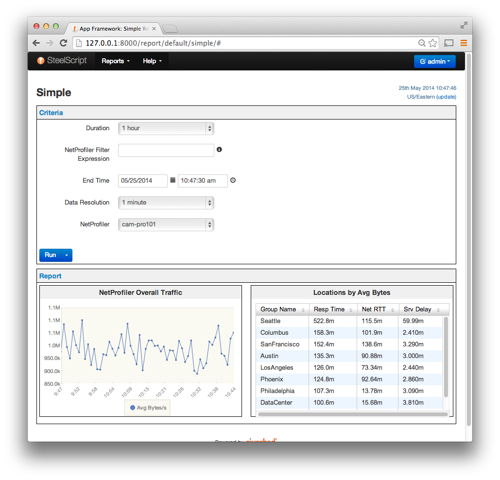

Reports, Sections and Widgets
=============================

In the application framework, a report is a single web page that
displays one or more widgets of data retrieved from one or more
data sources associated with the installation.

Overview
--------

The Web UI version of a report is comprised of:

**Criteria**

    A set of form fields for the user to fill in that serve as inputs
    to the back-end when running the report.  This includes selection
    fields, drop-down lists, text boxes that define the context for
    the report.

    There standard criteria such as start/end times and
    traffic filter expressions.  The report creator may
    also define custom criteria that is specific to this
    report or analysis functions required to generate.

**Widgets**

    Charts and tables that display the data associated with the
    report.  Each widget is independently rendered JavaScript.
    Typical widgets include time series charts, pie and bar charts,
    tables, and map widgets.

Under the covers, the report is built from multiple pieces
defined in a single Python source file:

**Widgets**

    A widget defines how a table's data will be displayed in the web
    UI.  Some widgets may have specific requirements about the
    structure of the data in the attached table.  For example, time
    series widget require that one of the columns is a date/time
    column.  Pie charts require at least one key column.  Note that
    while each defined widget must be bound to a table, the reverse is
    not necessarily true as some tables may be defined that are inputs
    to other tables.  In addition, it is possible to tie 2 or more
    widgets to the same table, providing different UI renderings of the
    same underlying data.

**Sections**

    Widgets are grouped into sections.  This division is currently
    solely for the purpose allowing for unique criteria per section.

**Reports**

    The report is the highest level container for the UI rendering of
    all the sections and widgets in the report configuration source
    file.  By default, all reports are listed in the "Reports" menu.
    In the Web UI, the report is displayed as a single page.

Sample Report Source File
~~~~~~~~~~~~~~~~~~~~~~~~~

Below is a sample report file:

.. code-block:: python

   from steelscript.appfwk.apps.report.models import Report
   import steelscript.appfwk.apps.report.modules.yui3 as yui3

   from steelscript.netprofiler.appfwk.datasources.netprofiler \
       import NetProfilerGroupbyTable, NetProfilerTimeSeriesTable
   from steelscript.netshark.appfwk.datasources.netshark \
       import NetSharkTable

   # Define the report and a single section
   report = Report.create("Overall")
   report.add_section('Main')

   # Define a Overall TimeSeries showing Avg Bytes/s
   table = NetProfilerTimeSeriesTable.create('timeseries')

   table.add_column('time', label='Time', datatype='time', iskey=True)
   table.add_column('avg_bytes', label='Avg Bytes/s', units='B/s')

   report.add_widget(yui3.TimeSeriesWidget, table, "NetProfiler Overall Traffic")

   # Define a table, group by location
   table = NetProfilerGroupbyTable.create('locations', groupby='host_group')

   table.add_column('group_name',    label='Group Name', iskey=True, datatype="string")
   table.add_column('response_time', label='Resp Time',  units='ms', sortdesc=True)
   table.add_column('network_rtt',   label='Net RTT',    units='ms')
   table.add_column('server_delay',  label='Srv Delay',  units='ms')

   # Adding a widget using the Report object will apply them
   # to the last defined Section, here that will be 'Locations'
   report.add_widget(yui3.TableWidget, table, "Locations by Avg Bytes", width=6)

This will get rendered as follows:

Notice that the criteria section has several fields for user input yet
the report source file does not declare any criteria.  This is because
each data source table (``NetProfilerTimeSeriesTable`` and
``NetProfilerGroupbyTable``) declares a set of criteria that it
requires in order to collect data for that report.

.. currentmodule:: steelscript.appfwk.apps.report.models

Creating a Report
-----------------

Report objects are Django model instances and thus once a report
object is instantiated and saved, the properties of the report are
saved in the database.

Report objects are created via :py:meth:`Report.create`:

.. automethod:: Report.create

Adding Sections to a Report
~~~~~~~~~~~~~~~~~~~~~~~~~~~

Section objects are Django model instances and backed by the database.
All sections must be bound to a Report.

The preferred method for creating a section is to use
:py:meth:`Report.add_section`.  This ensures that the the section is
properly attached to the report.

.. automethod:: Report.add_section

.. automethod:: Section.create

Adding Widgets to a Report
~~~~~~~~~~~~~~~~~~~~~~~~~~

Widget objects are Django model instances and backed by the database.
All widgets must be bound to a section.

The preferred method for creating widgets is to use
:py:meth:`Section.add_widget` or
:py:meth:`Report.add_widget`.

.. automethod:: Section.add_widget

.. automethod:: Report.add_widget

The ``cls`` parameter to the ``add_widget`` method is the class
reference for the specific UI.  The following UI widget classes are
currently supported:

================================================ ===============================================
UI Widget Class                                  Description
================================================ ===============================================
:ref:`yui3.TableWidget <TableWidget>`            Table of rows and columns
:ref:`yui3.ChartWidget <ChartWidget>`            Generic YUI3 chart widget, base for Bar/Line
:ref:`yui3.BarWidget <BarWidget>`                Vertical bar chart
:ref:`yui3.LineWidget <LineWidget>`              Line chart, X-Axis is labels, Y-Axis is values
:ref:`yui3.PieWidget <PieWidget>`                Pie Charts
:ref:`yui3.TimeSeriesWidget <TimeSeriesWidget>`  Line chart where X-Axis is time/date
:ref:`maps.MapWidget <MapWidget>`                Overlay data on a map
:ref:`raw.TableWidget <raw_TableWidget>`         Unprocessed raw data display (testing/debug)
================================================ ===============================================

.. _TableWidget:

:py:class:`yui3.TableWidget <steelscript.appfwk.apps.report.modules.yui3.TableWidget>`
~~~~~~~~~~~~~~~~~~~~~~~~~~~~~~~~~~~~~~~~~~~~~~~~~~~~~~~~~~~~~~~~~~~~~~~~~~~~~~~~~~~~~~

.. currentmodule:: steelscript.appfwk.apps.report.modules.yui3
.. automethod:: TableWidget.create

.. _ChartWidget:

:py:class:`yui3.ChartWidget <steelscript.appfwk.apps.report.modules.yui3.ChartWidget>`
~~~~~~~~~~~~~~~~~~~~~~~~~~~~~~~~~~~~~~~~~~~~~~~~~~~~~~~~~~~~~~~~~~~~~~~~~~~~~~~~~~~~~~

.. currentmodule:: steelscript.appfwk.apps.report.modules.yui3
.. automethod:: ChartWidget.create

.. _BarWidget:

:py:class:`yui3.BarWidget <steelscript.appfwk.apps.report.modules.yui3.BarWidget>`
~~~~~~~~~~~~~~~~~~~~~~~~~~~~~~~~~~~~~~~~~~~~~~~~~~~~~~~~~~~~~~~~~~~~~~~~~~~~~~~~~~

.. currentmodule:: steelscript.appfwk.apps.report.modules.yui3
.. automethod:: BarWidget.create

.. _LineWidget:

:py:class:`yui3.LineWidget <steelscript.appfwk.apps.report.modules.yui3.LineWidget>`
~~~~~~~~~~~~~~~~~~~~~~~~~~~~~~~~~~~~~~~~~~~~~~~~~~~~~~~~~~~~~~~~~~~~~~~~~~~~~~~~~~~~

.. currentmodule:: steelscript.appfwk.apps.report.modules.yui3
.. automethod:: LineWidget.create

.. _PieWidget:

:py:class:`yui3.PieWidget <steelscript.appfwk.apps.report.modules.yui3.PieWidget>`
~~~~~~~~~~~~~~~~~~~~~~~~~~~~~~~~~~~~~~~~~~~~~~~~~~~~~~~~~~~~~~~~~~~~~~~~~~~~~~~~~~

.. currentmodule:: steelscript.appfwk.apps.report.modules.yui3
.. automethod:: PieWidget.create

.. _TimeSeriesWidget:

:py:class:`yui3.TimeSeriesWidget <steelscript.appfwk.apps.report.modules.yui3.TimeSeriesWidget>`
~~~~~~~~~~~~~~~~~~~~~~~~~~~~~~~~~~~~~~~~~~~~~~~~~~~~~~~~~~~~~~~~~~~~~~~~~~~~~~~~~~~~~~~~~~~~~~~~

.. currentmodule:: steelscript.appfwk.apps.report.modules.yui3
.. automethod:: TimeSeriesWidget.create

.. _MapWidget:

:py:class:`maps.MapWidget <steelscript.appfwk.apps.report.modules.maps.MapWidget>`
~~~~~~~~~~~~~~~~~~~~~~~~~~~~~~~~~~~~~~~~~~~~~~~~~~~~~~~~~~~~~~~~~~~~~~~~~~~~~~~~~~

.. currentmodule:: steelscript.appfwk.apps.report.modules.maps
.. automethod:: MapWidget.create

.. _raw_TableWidget:

:py:class:`raw.TableWidget <steelscript.appfwk.apps.report.modules.raw.TableWidget>`
~~~~~~~~~~~~~~~~~~~~~~~~~~~~~~~~~~~~~~~~~~~~~~~~~~~~~~~~~~~~~~~~~~~~~~~~~~~~~~~~~~~~

.. currentmodule:: steelscript.appfwk.apps.report.modules.raw
.. automethod:: TableWidget.create
