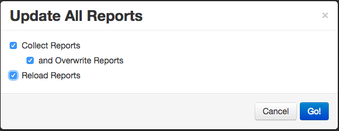
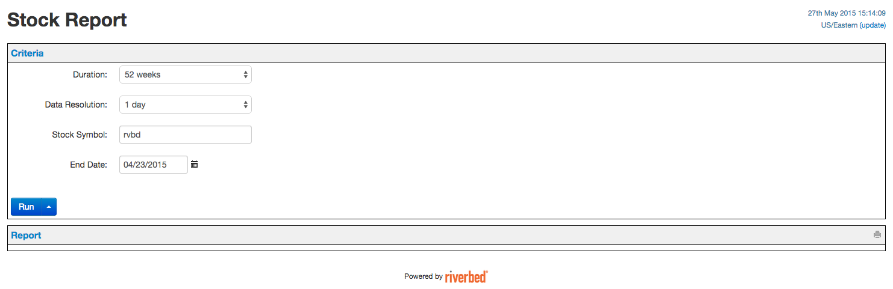
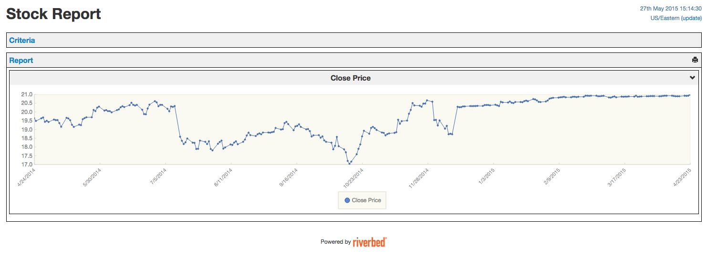

.. _plugin tutorial:

Writing a Plugin
================

This tutorial presents a step-by-step description of how to develop a
SteelScript App Framework  plugin. No tutorial can be as useful as an example.
Therefore, in this tutorial, a steelscript-stock plugin is used to explain
the process of how to construct SteelScript App Framework plugin. Note that
the stock data is fetched from yahoo finance API as a third party resource.
By changing the data source as well as modifying the reports, App Framework
plugin can be used to display data from almost any where, such as a csv file,
a rest API or a device with reporting capability, etc.

Creating the skeleton of a plugin
---------------------------------

First we need to run the command ``steel appfwk mkplugin`` in a shell:

.. code-block:: python

   $ cd /tmp
   $ steel appfwk mkplugin
   Give a simple name for your plugin (a-z, 0-9, _): stock
   Give your plugin a title []: Steelscript Stock
   Briefly describe your plugin []: Steelscript Stock App Framework Plugin
   Author's name []: author
   Author's email []: email
   Writing:  /private/tmp/steelscript-stock/LICENSE
   Writing:  /private/tmp/steelscript-stock/MANIFEST.in
   Writing:  /private/tmp/steelscript-stock/README.rst
   Writing:  /private/tmp/steelscript-stock/setup.py
   Writing:  /private/tmp/steelscript-stock/gitpy_versioning/__init__.py
   Writing:  /private/tmp/steelscript-stock/steelscript/__init__.py
   Writing:  /private/tmp/steelscript-stock/steelscript/stock/__init__.py
   Writing:  /private/tmp/steelscript-stock/steelscript/stock/appfwk/__init__.py
   Writing:  /private/tmp/steelscript-stock/steelscript/stock/appfwk/admin.py
   Writing:  /private/tmp/steelscript-stock/steelscript/stock/appfwk/models.py
   Writing:  /private/tmp/steelscript-stock/steelscript/stock/appfwk/plugin.py
   Writing:  /private/tmp/steelscript-stock/steelscript/stock/appfwk/datasources/__init__.py
   Writing:  /private/tmp/steelscript-stock/steelscript/stock/appfwk/datasources/stock_source.py
   Writing:  /private/tmp/steelscript-stock/steelscript/stock/appfwk/devices/__init__.py
   Writing:  /private/tmp/steelscript-stock/steelscript/stock/appfwk/devices/stock_device.py
   Writing:  /private/tmp/steelscript-stock/steelscript/stock/appfwk/libs/__init__.py
   Writing:  /private/tmp/steelscript-stock/steelscript/stock/appfwk/reports/__init__.py
   Writing:  /private/tmp/steelscript-stock/steelscript/stock/appfwk/reports/stock_report.py
   Writing:  /private/tmp/steelscript-stock/steelscript/stock/commands/__init__.py
   Writing:  /private/tmp/steelscript-stock/steelscript/stock/commands/README.rst
   Writing:  /private/tmp/steelscript-stock/steelscript/stock/commands/subcommand.py
   Writing:  /private/tmp/steelscript-stock/steelscript/stock/core/__init__.py
   Writing:  /private/tmp/steelscript-stock/steelscript/stock/core/README.rst
   Checking if git is installed...done
   Initializing project as git repo...done
   Creating initial git commit...done
   Tagging as release 0.0.1...done

Installing from source
----------------------
Once you have created the source tree of you plugin, you need to install it as below.

.. code-block:: bash

   $ cd steelscript-stock
   $ pip install -e .

Details about installing steelscript plugin can be found
:ref:`Installing a plugin <installing a plugin>`.

.. _Data fetch API:

Developing data fetch API
-------------------------
You need to develop an API to fetch data to feed the App Framework engine. This step is recommended
to be done early as we can understand better the data format, which would help define the
structure of the App Framework reports later.

First we need to create a python module app.py in steelscript/stock/core directory. The reason
the module ``app.py`` resides in ``core`` directory instead of ``appfwk`` directory is that the API can
be used independently without App Framework. Below shows how a stock data API might look like.

.. code-block:: python

    from steelscript.common.timeutils import TimeParser
    from steelscript.common.connection import Connection

    # Mapping from price measure to the relative position
    # in the response string
    mapping = {'open': 1,
               'high': 2,
               'low': 3,
               'close': 4,
               'volume': 5}

    tp = TimeParser()

    def parse_date(date):
        return tp.parse(date + " 00:00")

    class StockApiException(Exception):
        pass

    def get_historical_prices(begin, end, symbol, measures,
                              resolution='day', date_obj=False):
        """Get historical prices for the given ticker symbol.
        Returns a list of dicts keyed by 'date' and measures

        :param string begin: begin date of the inquire interval
          in the format of YYYY-MM-DD
        :param string end: end date of the inquire interval
          in the format of YYYY-MM-DD
        :param string symbol: symbol of one stock to query
        :param list measures: a list of prices that needs to be queried,
          should be a subset of ["open", "high", "low", "close", "volume"]
        :param string resolution: 'day' or 'week'
        :param boolean date_obj: dates are converted to datetime objects
          from date strings if True. Otherwise, dates are stored as strings
        """
        conn = Connection('http://ichart.finance.yahoo.com')
        start_month = parse_date(begin).month - 1
        start_day = parse_date(begin).day
        start_year = parse_date(begin).year
        end_month = parse_date(end).month - 1
        end_day = parse_date(end).day
        end_year = parse_date(end).year

        ret = []
        params = {'s': symbol,
                  'a': start_month,
                  'b': start_day,
                  'c': start_year,
                  'd': end_month,
                  'e': end_day,
                  'f': end_year,
                  'g': resolution[0],
                  'ignore':'.csv'}

        resp = conn.request(method='POST', path='/table.csv', params=params)

        # extract data and skip first row with column titles
        data = list(resp.iter_lines())[1:]

        # iterate over the data backwards as the daily prices are sorted
        # backwards by the dates
        for day in reversed(data):
            # day is a string with date, prices, volume separated by commas,
            # '<date>,<open>,<high>,<low>,<close>,<volume>,<adj_close>'
            # as '2014-02-19,20.22,20.55,20.11,20.50,1599600,20.50'
            day = day.split(',')
            date = parse_date(day[0]) if date_obj else day[0]
            daily_prices = {'date': date}
            for m in measures:
                if m in mapping:
                    daily_prices[m] = float(day[mapping[m]])
            ret.append(daily_prices)
        return ret

The above function get_historical_prices leverages the yahoo stock api to get the
daily transaction volumes as well as daily prices (including high, low, open and close)
for a stock within a date range. The return date format is a list of python dicts, with
each dict represent the data of the stock for one day.

.. code-block:: python

    >>> from steelscript.stock.core.app import get_historical_prices
    >>> from pprint import pprint
    >>> pprint(get_historical_prices(begin='2015-04-01', end='2015-04-05', symbol='rvbd', measures=['open','close', 'high', 'low','volume']))
    [{'close': 20.92,
      'date': '2015-04-01',
      'high': 20.92,
      'low': 20.9,
      'open': 20.91,
      'volume': 1754900.0},
     {'close': 20.92,
      'date': '2015-04-02',
      'high': 20.94,
      'low': 20.9,
      'open': 20.91,
      'volume': 1851400.0},
     {'close': 20.92,
      'date': '2015-04-03',
      'high': 20.92,
      'low': 20.92,
      'open': 20.92,
      'volume': 0.0}]

Creating App Framework reports
------------------------------
From the above API, we can see that in order to generate stock data, we need to pass in
parameters, including stock symbol, start date, end date, the price names, resolution.
The returned data can have information such as dates, daily (include open, close
high, low) prices, and daily transaction volumes.

Now that the data format has been understood, one can set out to create the Application
Framework components for reports. The first step will be defining a data source, which
sets up the required criteria fields for users to input, and then extract data using the
:ref:`API<Data fetch API>` based on the input criteria values. Then we need to write the
report using the defined data source to render the data. For illustrative purpose, let us
build a simple report that can show the close price of a stock given a range of dates.

Writing data source
^^^^^^^^^^^^^^^^^^^
The generated stock_source.py has included some skeleton code, including
the declaration of the ``StockColumn`` class, the ``StockTable`` class and the ``StockQuery`` class.
For normal reports, there is no need to modify the ``StockColumn`` class. We need to
modify the ``StockTable`` class in order to add criteria, which maps to the parameters passed
to the data fetch API. Details are shown below.

.. code-block:: python

    from steelscript.appfwk.apps.datasource.models import TableField
    from steelscript.appfwk.apps.datasource.forms import (DateTimeField, ReportSplitDateWidget,
                                                          fields_add_time_selection, fields_add_resolution)
    from steelscript.appfwk.apps.datasource.models import TableField, DatasourceTable, Column
    from steelscript.appfwk.apps.jobs import QueryComplete

    class StockColumn(Column):
        class Meta:
            proxy = True

        COLUMN_OPTIONS = {}

    class StockTable(DatasourceTable):

        class Meta:
            proxy = True

        # When a custom column is used, it must be linked
        _column_class = 'StockColumn'

        # Using StockQuery class to extract data
        _query_class = 'StockQuery'

        # TABLE_OPTIONS is a dictionary of options that are specific to
        # StockQuery objects in this file.  These will be overridden by
        # keyword arguments to the StockTable.create() call in a report
        # file
        TABLE_OPTIONS = { }

        # FIELD_OPTIONS is a dictionary of default values for field
        # options.  These by be overridden by keyword arguments to the
        # StockTable.create() call in a report file
        FIELD_OPTIONS = {'duration': '4w',
                         'durations': ('4w', '12w', '24w', '52w', '260w', '520w'),
                         'resolution': 'day',
                         'resolutions': ('day', 'week')
                         }

        def post_process_table(self, field_options):
            # Add a time selection field
            fields_add_time_selection(self, show_end=False,
                                      initial_duration=field_options['duration'],
                                      durations=field_options['durations'])

            # Add time resolution selection
            fields_add_resolution(self,
                                  initial=field_options['resolution'],
                                  resolutions=field_options['resolutions'])

            # Add end date field
            self.fields_add_end_date()
            self.fields_add_stock_symbol()

        def fields_add_stock_symbol(self, keyword='stock_symbol',
                                    initial=None):
            field = TableField(keyword=keyword,
                               label='Stock Symbol',
                               initial=initial,
                               required=True)
            field.save()
            self.fields.add(field)

        def fields_add_end_date(self, initial_end_date='now-0'):
            # Add a date field
            # the front javascript code will determine the default date
            # according to initial_end_date, so if initial_end_date is
            # 'now-0', today will be the default end date
            field = TableField(keyword='end_date',
                               label='End Date',
                               field_cls=DateTimeField,
                               field_kwargs={'widget': ReportSplitDateWidget,
                                             'widget_attrs': {'initial_date':
                                                              initial_end_date}},
                               required=False)
            field.save()
            self.fields.add(field)

From the above, it can be seen that the function ``post_process_table`` in the ``StockTable`` class
defines the criteria fields. There are four fields added, including duration, end date, stock symbol
and resolution (the start date can be figured out using end date and duration). The values of
duration and resolution are limited to a few.

After the ``StockTable`` class in the same module, we need to define the ``run`` method in
``StockQuery`` class, which is about using the values from the criteria fields in the
``StockTable`` class to derive the data by leveraging the
:ref:`data fetch API <Data fetch API>`. See below for details:

.. code-block:: python

    import pandas

    from steelscript.stock.core.app import get_historical_prices
    from steelscript.appfwk.apps.datasource.models import TableField, TableQueryBase

    class StockQuery(TableQueryBase):

        def __init__(self, table, job):
            self.table = table
            self.job = job

        def run(self):
            criteria = self.job.criteria

            # These are date time strings in the format of YYYY-MM-DD
            self.t0 = str((criteria.end_date - criteria.duration).date())
            self.t1 = str((criteria.end_date).date())

            # resolution is either 'day' or 'week'
            self.resolution = 'day' if str(criteria.resolution).startswith('1 day') else 'week'

            # stock symbol string
            self.symbol = criteria.stock_symbol

            # Dict storing stock prices/volumes according to specific report
            prices = get_historical_prices(self.t0, self.t1, self.symbol, ['close'],
                                           self.resolution, date_obj=True)

            if prices:
                df = pandas.DataFrame(prices)
            else:
                df = None

            return QueryComplete(df)

.. note::
    This method only returns a ``QueryComplete`` object with a ``pandas.DataFrame``
    object as an attribute after it is successful. If this function failed or no data is
    obtained, an error message will be presented in App Framework widget.

Writing Reports
^^^^^^^^^^^^^^^
After finishing off writing data sources, finally it is time to collect results.
In <plugin>/appfwk/reports/stock_report.py, we first need to define a report and
create a section asscociated with it.

.. code-block:: python

    from steelscript.appfwk.apps.report.models import Report
    report = Report.create("Stock Report")
    report.add_section()

Next step is to instantiate the ``StockTable`` class and add columns to the table object.

.. code-block:: python

    import steelscript.stock.appfwk.datasources.stock_source as stock
    table = stock.StockTable.create(name='stock-close-price',
                                    duration='52w', resolution='day')
    table.add_column('date', 'Date', datatype='date', iskey=True)
    table.add_column('close', 'Close Price')

.. note::
    When creating the stock table object, the passed-in duration and resolution values need to be
    one of the few options listed in ``FIELD_OPTIONS`` in ``StockTable`` class. When adding columns to the
    table, the first parameter, representing the name of the column, needs to be one of the keys in the dict
    returned by the :ref:`Data fetch API<Data fetch API>`. For ``date`` column, the ``datatype`` parameter
    needs to be 'date'. Since we plan to plot the data against the dates, the ``date`` column needs to
    be specified as the key column, as done by setting ``iskey=True``.

Last step is to add a widget to the report and bind the table to the widget at the same time.

.. code-block:: python

    # Bind the table to a widget for display
    import steelscript.appfwk.apps.report.modules.yui3 as yui3
    report.add_widget(yui3.TimeSeriesWidget, table, 'Close Price', width=12)

.. note::
    Since the report is a plot based on time, we use yui3.TimeSeriesWidget as the
    widget class. Setting ``width=12`` will span the widget across the whole browser, as the whole browser
    has 12 'columns'.

Rendering reports
-----------------
Before running the report, we need to ask the App Framework site to load it. If the report was
added to the ``<appfwk_project>/reports`` directory, one needs to click 'Reload All Reports'
option from the dropdown menu of the admin button at the top right corner. If the report was added to
the plugin directory, one needs to first click 'Edit Plugins' option from the dropdown menu
of the admin button, then click the 'Update All Report' button at the bottom, then check the boxes
for 'Collect Reports', 'and Overwrite Reports' and 'Reload Reports' at the popup window, and finally
click the 'Go!' button, shown as the image below. More information about picking up plugin reports are
described :ref:`here <plugin reports>`.

Now, Let us start running the App Framework site in the browser.
After clicking 'Stock Report' in the dropdown menu of the 'Reports' tab in the top tool bar, the criteria
fields are shown as below.

After click 'Run' button, the 'close' price per day for the stock 'rvbd' for the last year is shown as below.

Leveraging App Framework device
-------------------------------
For this stock plugin, there is no physical stock device to configure. But often times,
we need to interact with a device to fetch data and generate reports. Although it is possible
just to put necessary device-related fields in the criteria and run the :ref:`data fetch API<Data fetch API>`,
the operation suffers from two flaws: firstly, the criteria fields would be cluttered with
hostname, port, username, password and module fields, all of which would not change between running
reports against the same device; Secondly, it would be very costly to reconnect to the device
every time the report is run. Configuring a device separately from running reports can reduce
the amount information to deal with when filling criteria. It can also cache the device connection
and thus reduce network latency for future reporting runs.

In order to be able to use 'Device' functionality in the App Framework plugin, the first step is to write
a corresponding device class which can be used as the main interface to interact with the appliance,
handling initialization, setup, and communication. One example is the
`NetProfiler <https://support.riverbed.com/apis/steelscript/netprofiler/netprofiler.html#netprofiler-objects>`_
class. The second step involves modifying ``appfwk/devices/<plugin>_device.py`` to
instantiate the defined appliance class. In the case of NetProfiler,
the code is shown as below.

.. code-block:: python

    from steelscript.netprofiler.core.netprofiler import NetProfiler

    def new_device_instance(*args, **kwargs):
        # Used by DeviceManager to create a NetProfiler instance
        return NetProfiler(*args, **kwargs)

Lastly, when writing data source, a device field needs to be added to the criteria. Take NetProfiler
for example, the code is shown as below.

.. code-block:: python

    from steelscript.appfwk.apps.devices.forms import fields_add_device_selection

    class NetProfilerTable(DatasourceTable):

        def post_process_table(self, field_options):
            fields_add_device_selection(self, keyword='netprofiler_device',
                                        label='NetProfiler', module='netprofiler',
                                        enabled=True)

Now admin user can configure a device for the plugin, and normal users can select corresponding
device before running associated reports against it. More info can be found :ref:`here <devices>`.

